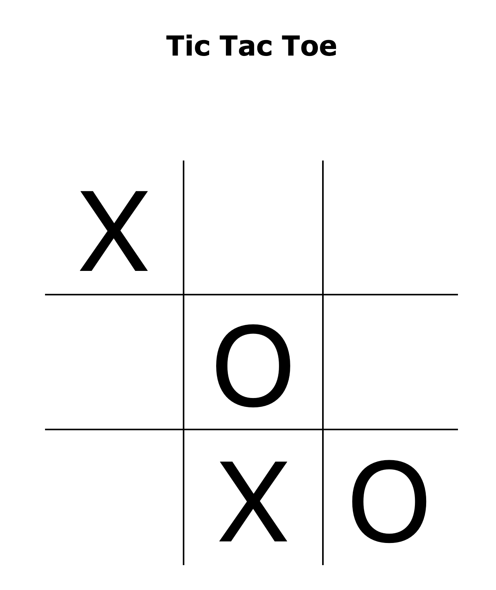

# odin-TicTacToe

#### Access the page [here](https://benjamin-albarzendji.github.io/odin-TicTacToe/)

### Description
While this may appear as a simple Tic-Tac-Toe game, it is for me a considerable step up in my JavaScripting skills. This was created with close to no HTML elements, with everything being dynamically created by JavaScript and removed from JavaScript. There are no global variables, as I have learned to use modules or IIFE functions as they are called. I have also experimented with more advanced CSS transitions, making for a fun dynamic experience. 

